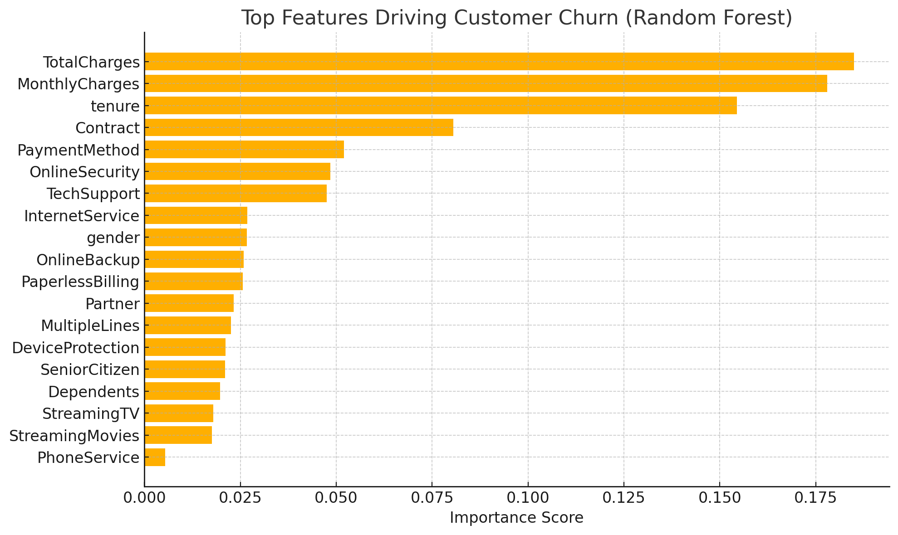

# churn-prediction-telco
A quick churn prediction model using logistic regression and random forest
# 📊 Customer Churn Prediction – Telco Dataset

This project predicts customer churn using machine learning models (Logistic Regression & Random Forest) on the Telco Customer Churn dataset. It demonstrates a full data analysis workflow from cleaning to modeling and evaluation.

## 📁 Dataset
- Source: [Telco Customer Churn - Kaggle](https://www.kaggle.com/datasets/blastchar/telco-customer-churn)

## 📌 Objectives
- Understand key factors that lead to customer churn
- Build interpretable machine learning models
- Identify top churn indicators to support business decisions

## 🧰 Tools & Libraries
- Python
- pandas, scikit-learn, matplotlib
- Jupyter Notebook

## 🔍 Key Steps
1. Data cleaning (missing values, encoding)
2. Feature engineering
3. Logistic Regression and Random Forest modeling
4. Evaluation with accuracy, recall, confusion matrix
5. Feature importance analysis

## ✅ Results
- Best model: Random Forest (~79% accuracy)
- Top churn indicators: `TotalCharges`, `MonthlyCharges`, `tenure`, `Contract`

## 📈 Sample Output
 *(Optional: Add plot)*

---

## 🚀 How to Run
```bash
pip install pandas scikit-learn matplotlib
jupyter notebook Churn_Prediction_Project.ipynb
